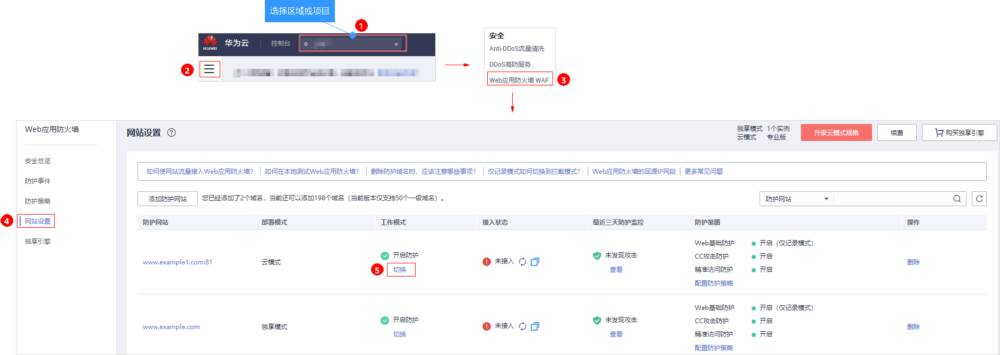

# 切换工作模式

该章节指导用户通过Web应用防火墙服务切换工作模式。Web应用防火墙提供了三种工作模式：

-   开启防护：开启防护模式后，WAF会根据您配置的策略进行攻击检测。
-   暂停防护：如果大量的正常业务被拦截，比如大量返回418返回码，可以将“工作模式“切换为“暂停防护“。该模式下，WAF对所有的流量请求只转发不检测。该模式存在风险，建议您优先选择误报屏蔽规则处理正常业务拦截问题。
-   Bypass：该域名的请求直接到达其后端服务器，不再经过WAF。只有出现以下情况，才能将“工作模式“切换为“Bypass“：
    -   当有测试等特殊场景，需要将业务恢复到没有接入WAF的状态，可以通过Bypass功能切换。
    -   排查网站异常，例如报502、504或其他不兼容等问题。
    -   在Web应用防火墙前面未使用代理。

## 前提条件

-   已获取管理控制台的账号和密码。
-   已添加防护域名。

## 操作步骤

1.  [登录管理控制台](https://console.huaweicloud.com/?locale=zh-cn)。
2.  进入切换工作模式入口，如[图1](#fig1643164415518)所示。

    **图 1**  切换工作模式  
    

3.  在弹出的“切换工作模式“对话框中，选择目标工作模式，单击“确定“。

