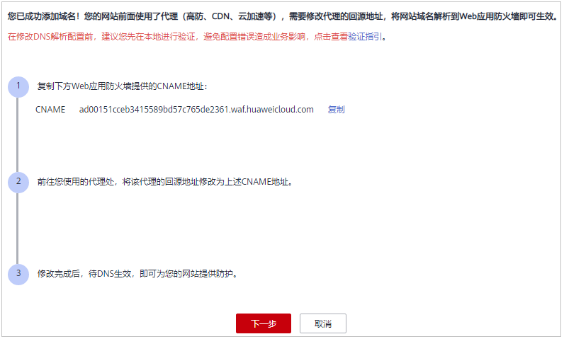
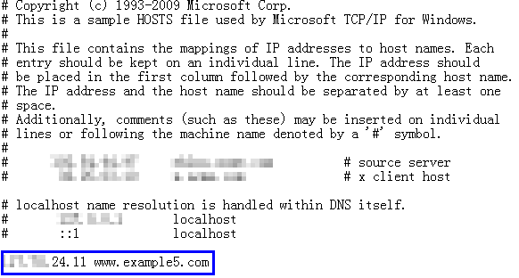

# 本地验证

为了确保WAF转发正常，在修改DNS解析配置前，建议您先通过本地验证确保一切配置正常。

进行此操作前，确保添加的防护域名（例如：www.example5.com）的源站服务器协议、地址、端口配置正确，如果“对外协议“类型选择了“HTTPS“，也必须确保上传的证书和私钥正确。

## 前提条件

已获取管理控制台的账号和密码。

## 本地接入WAF

1.  获取CNMAE值。
    -   如果您正在添加防护域名，在配置域名基本信息后，请参考以下方式获取域名的CNAME值。

        单击“复制“，获取防护域名的CNAME值，如[图1](#fig14653411747)或[图2](#fig1779301543)所示。

        **图 1**  域名接入（使用代理）  
        

        **图 2**  域名接入（未使用代理）  
        

    -   如果您已完成添加域名，请参考以下操作步骤获取域名的CNAME值。
        1.  进入域名配置页面入口，如[图3](#fig172535820151)所示。

            **图 3**  域名列表入口  
            

        2.  在目标域名所在行的“防护域名“列中，单击目标域名，进入域名基本信息页面。
        3.  在“CNAME“信息行，单击，复制“CNAME“值。

2.  ping“CNAME“值并记录“CNAME“对应的IP地址。

    以域名www.example5.com为例，该域名已添加到WAF的网站配置中，且WAF为其分配了以下CNAME值：xxxxxxxdc1b71f718f233caf77.waf.huaweicloud.com。

    在Windows中打开cmd命令行工具，运行ping xxxxxxxdc1b71f718f233caf77.waf.huaweicloud.com获取WAF的回源IP。如[图4](#fig3609445192)所示，在响应结果中可以看到用来防护您的域名的WAF回源IP。

    **图 4**  ping cname  
    

3.  在本地修改hosts文件，将域名及“CNAME“对应的WAF回源IP添加到“hosts“文件。
    1.  用记事本或notepad++等文本编辑器打开hosts文件，hosts文件一般位于“C:\\Windows\\System32\\drivers\\etc\\“路径下。
    2.  在hosts文件添加如[图6 追加记录](#fig386011112317)内容，前面的IP地址即在[步骤2](#li132916207364)中获取的WAF回源IP地址，后面的域名即被防护的域名。

        **图 5**  追加记录  
        

    3.  修改hosts文件后保存，然后本地ping一下被防护的域名。

        **图 6**  ping域名  
        

        预期此时解析到的IP地址应该是[2](#li4860411142315)中绑定的WAF回源IP地址。如果依然是源站地址，可尝试刷新本地的DNS缓存（Windows的cmd下可以使用**ipconfig/flushdns**命令）。

## 验证WAF转发正常

1.  清理浏览器缓存，在浏览器中输入防护域名，测试网站域名是否能正常访问。

    如果hosts绑定已经生效（域名已经本地解析为WAF回源IP）且WAF的配置正确，访问该域名，预期网站能够正常打开。

2.  手动模拟简单的web攻击命令，测试Web攻击请求。
    1.  将Web基础防护的状态设置为“拦截“模式，具体方法请参见[配置Web基础防护规则](配置Web基础防护规则.md)。
    2.  清理浏览器缓存，在浏览器中输入“http://www.example5.com?id=1%20or%201%20=1“模拟SQL注入攻击，测试WAF是否拦截了此条攻击，如[图7](#fig1471040175918)所示。

        **图 7**  访问被拦截  
        

    3.  可通过“安全  \>  Web应用防火墙“ ，单击“防护事件“，进入“防护事件“页面，查看防护域名测试的各项数据，如[图8](#fig1348440105913)所示。

        **图 8**  查看测试数据  
        

