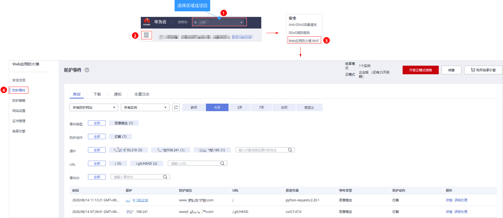

# 查看防护日志

Web应用防火墙将拦截或者仅记录攻击事件记录在“防护事件“页面。您可以根据此章节查看WAF的防护日志。

> **须知：** 
>-   在WAF控制台只能查看所有防护域名最近30天的防护事件数据。您可以通过开启全量日志长期保存日志，并查看攻击日志和访问日志的详细信息。有关开启全量日志的详细操作，请参见[开启全量日志](zh-cn_topic_0228061142.md)。
>-   检测版只能查看Web基础防护的仅记录攻击事件。

## 前提条件

防护网站已接入WAF。

## 操作步骤

1.  [登录管理控制台](https://console.huaweicloud.com/?locale=zh-cn)。
2.  进入防护事件页面入口，如[图1](#fig182151235121911)所示。

    **图 1**  防护事件页面入口  
    

3.  选择“查询“页签，在网站或实例下拉列表中选择待查看的防护网站或实例，可查看“昨天“、“今天“、“3天““7天“、“30天“或者自定义时间范围内的防护日志，如[图2](#zh-cn_topic_0110861226_fig194311743164914)所示，参数说明如[表1](#zh-cn_topic_0110861226_table146358613417)和[表2](#zh-cn_topic_0110861226_table135241210519)所示。

    **图 2**  查看防护事件  
    

    **表 1**  防护事件参数说明

    
    <table><thead align="left"><tr id="zh-cn_topic_0110861226_row863606163419"><th class="cellrowborder" valign="top" width="35.809999999999995%" id="mcps1.2.3.1.1">
参数名称

    </th>
    <th class="cellrowborder" valign="top" width="64.19%" id="mcps1.2.3.1.2">
参数说明

    </th>
    </tr>
    </thead>
    <tbody><tr id="zh-cn_topic_0110861226_row18636563347"><td class="cellrowborder" valign="top" width="35.809999999999995%" headers="mcps1.2.3.1.1 ">
事件类型

    </td>
    <td class="cellrowborder" valign="top" width="64.19%" headers="mcps1.2.3.1.2 ">
发生攻击的类型。

    
默认选择“全部”，查看所有攻击类型的日志信息，也可以根据需要，选择攻击类型查看攻击日志信息。

    </td>
    </tr>
    <tr id="zh-cn_topic_0110861226_row14240104218184"><td class="cellrowborder" valign="top" width="35.809999999999995%" headers="mcps1.2.3.1.1 ">
防护动作

    </td>
    <td class="cellrowborder" valign="top" width="64.19%" headers="mcps1.2.3.1.2 ">
防护配置中设置的防护动作，包含：拦截、仅记录、人机验证、放行和过滤。

    </td>
    </tr>
    <tr id="zh-cn_topic_0110861226_row1563616616349"><td class="cellrowborder" valign="top" width="35.809999999999995%" headers="mcps1.2.3.1.1 ">
源IP

    </td>
    <td class="cellrowborder" valign="top" width="64.19%" headers="mcps1.2.3.1.2 ">
Web访问者的公网IP地址（攻击者IP地址）。

    
默认选择“全部”，查看所有的日志信息，也可以根据需要，选择或者自定义攻击者IP地址查看攻击日志信息。

    </td>
    </tr>
    <tr id="zh-cn_topic_0110861226_row188821953151813"><td class="cellrowborder" valign="top" width="35.809999999999995%" headers="mcps1.2.3.1.1 ">
URL

    </td>
    <td class="cellrowborder" valign="top" width="64.19%" headers="mcps1.2.3.1.2 ">
攻击的防护域名的URL。

    </td>
    </tr>
    <tr id="zh-cn_topic_0110861226_row1698513261914"><td class="cellrowborder" valign="top" width="35.809999999999995%" headers="mcps1.2.3.1.1 ">
事件ID

    </td>
    <td class="cellrowborder" valign="top" width="64.19%" headers="mcps1.2.3.1.2 ">
标识该防护事件的ID。

    </td>
    </tr>
    </tbody>
    </table>

    **表 2**  日志列表参数说明

    
    <table><thead align="left"><tr id="zh-cn_topic_0110861226_row135266102011"><th class="cellrowborder" valign="top" width="50%" id="mcps1.2.3.1.1">
参数名称

    </th>
    <th class="cellrowborder" valign="top" width="50%" id="mcps1.2.3.1.2">
参数说明

    </th>
    </tr>
    </thead>
    <tbody><tr id="zh-cn_topic_0110861226_row152661018114"><td class="cellrowborder" valign="top" width="50%" headers="mcps1.2.3.1.1 ">
时间

    </td>
    <td class="cellrowborder" valign="top" width="50%" headers="mcps1.2.3.1.2 ">
发生本次攻击的时间。

    </td>
    </tr>
    <tr id="zh-cn_topic_0110861226_row352616101114"><td class="cellrowborder" valign="top" width="50%" headers="mcps1.2.3.1.1 ">
源IP

    </td>
    <td class="cellrowborder" valign="top" width="50%" headers="mcps1.2.3.1.2 ">
Web访问者的公网IP地址（攻击者IP地址）。

    </td>
    </tr>
    <tr id="zh-cn_topic_0110861226_row652611010115"><td class="cellrowborder" valign="top" width="50%" headers="mcps1.2.3.1.1 ">
防护域名

    </td>
    <td class="cellrowborder" valign="top" width="50%" headers="mcps1.2.3.1.2 ">
被攻击的防护域名。

    </td>
    </tr>
    <tr id="zh-cn_topic_0110861226_row10526810313"><td class="cellrowborder" valign="top" width="50%" headers="mcps1.2.3.1.1 ">
URL

    </td>
    <td class="cellrowborder" valign="top" width="50%" headers="mcps1.2.3.1.2 ">
攻击的防护域名的URL。

    </td>
    </tr>
    <tr id="zh-cn_topic_0110861226_row635713296113"><td class="cellrowborder" valign="top" width="50%" headers="mcps1.2.3.1.1 ">
恶意负载

    </td>
    <td class="cellrowborder" valign="top" width="50%" headers="mcps1.2.3.1.2 ">
发生攻击的恶意负载位置。

    </td>
    </tr>
    <tr id="zh-cn_topic_0110861226_row33596297111"><td class="cellrowborder" valign="top" width="50%" headers="mcps1.2.3.1.1 ">
事件类型

    </td>
    <td class="cellrowborder" valign="top" width="50%" headers="mcps1.2.3.1.2 ">
发生攻击的类型。

    </td>
    </tr>
    <tr id="zh-cn_topic_0110861226_row17359429116"><td class="cellrowborder" valign="top" width="50%" headers="mcps1.2.3.1.1 ">
防护动作

    </td>
    <td class="cellrowborder" valign="top" width="50%" headers="mcps1.2.3.1.2 ">
防护配置中设置的防护动作，包含：拦截、仅记录、人机验证、放行和过滤。

    </td>
    </tr>
    </tbody>
    </table>

    > **说明：** 
    >如果需要查看目标域名攻击事件详情，可在事件列表中的“操作“列，单击“详情“。

