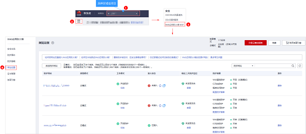
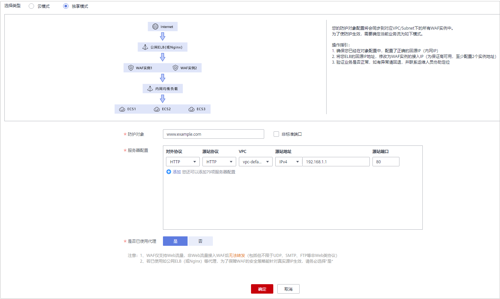
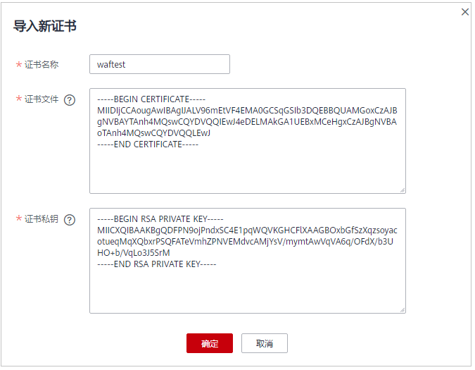

# 添加防护网站

如果您的业务服务器部署在华为云上，您可以将网站的域名或IP添加到WAF，使网站流量切入WAF。

## 前提条件

已购买WAF独享引擎实例。

## 操作步骤

1.  [登录管理控制台](https://console.huaweicloud.com/?locale=zh-cn)。
2.  进入网站配置页面入口，如[图1](#zh-cn_topic_0110861354_fig172535820151)所示。

    **图 1**  网站列表入口  
    

3.  在网站列表左上角，单击“添加防护网站“。
4.  选择“独享模式“后，在页面配置域名基本信息，如[图2](#fig175731754141418)所示，相关参数说明如[表1](#table7692122554811)所示。

    **图 2**  配置网站基本信息  
    

    **表 1**  基本信息参数说明

    
    <table><thead align="left"><tr id="row1068752517484"><th class="cellrowborder" valign="top" width="15%" id="mcps1.2.4.1.1">
参数

    </th>
    <th class="cellrowborder" valign="top" width="64.21%" id="mcps1.2.4.1.2">
参数说明

    </th>
    <th class="cellrowborder" valign="top" width="20.79%" id="mcps1.2.4.1.3">
取值样例

    </th>
    </tr>
    </thead>
    <tbody><tr id="row1368718254486"><td class="cellrowborder" valign="top" width="15%" headers="mcps1.2.4.1.1 ">
防护对象

    </td>
    <td class="cellrowborder" valign="top" width="64.21%" headers="mcps1.2.4.1.2 ">
防护的域名或IP，域名支持单域名和泛域名。

    <ul id="ul9206119142513"><li>单域名：输入防护的单域名。例如：www.example.com。</li><li>泛域名
 说明： 

泛域名不支持下划线（_）。

    

    <ul id="ul776103520251"><li>如果各子域名对应的服务器IP地址相同：输入防护的泛域名。例如：子域名a.example.com，b.example.com和c.example.com对应的服务器IP地址相同，可以直接添加泛域名*.example.com。</li><li>如果各子域名对应的服务器IP地址不相同：请将子域名按“单域名”方式逐条添加。</li></ul>
    </li></ul>
    </td>
    <td class="cellrowborder" valign="top" width="20.79%" headers="mcps1.2.4.1.3 ">
单域名：www.example.com

    
泛域名：*.example.com

    
IP：

    
XXX.XXX.1.1

    </td>
    </tr>
    <tr id="row116884252488"><td class="cellrowborder" valign="top" width="15%" headers="mcps1.2.4.1.1 ">
端口

    </td>
    <td class="cellrowborder" valign="top" width="64.21%" headers="mcps1.2.4.1.2 ">
可选参数，仅当用户勾选“非标准端口”时需要配置。端口的配置示例如<a href="zh-cn_topic_0110861354.md#section04061341181016">配置示例一：防护同一端口的不同源站IP的标准端口业务</a>。

    <ul id="ul86882025104815"><li>“对外协议”选择“HTTP”时，WAF默认防护“80”标准端口的业务；“对外协议”选择“HTTPS”时，WAF默认防护“443”标准端口的业务。</li><li>如需配置除“80”/“443”以外的端口，勾选“非标准端口”，在“端口”下拉列表中选择非标准端口。
Web应用防火墙支持的非标准端口请参见<a href="https://support.huaweicloud.com/waf_faq/waf_01_0032.html" target="_blank" rel="noopener noreferrer">Web应用防火墙支持的非标准端口</a>。

    </li></ul>
    
 说明： 

如果配置了非标准端口，访问网站时，需要在网址后面增加非标准端口进行访问，否则访问网站时会出现<a href="https://support.huaweicloud.com/waf_faq/waf_01_0066.html#section0" target="_blank" rel="noopener noreferrer">404错误</a>。

    

    </td>
    <td class="cellrowborder" valign="top" width="20.79%" headers="mcps1.2.4.1.3 ">
81

    </td>
    </tr>
    <tr id="row5690192514820"><td class="cellrowborder" valign="top" width="15%" headers="mcps1.2.4.1.1 ">
服务器配置

    </td>
    <td class="cellrowborder" valign="top" width="64.21%" headers="mcps1.2.4.1.2 ">
网站服务器地址的配置。包括对外协议、源站协议、VPC、源站地址和源站端口。

    <ul id="ul16689625134815"><li>对外协议：客户端请求到WAF独享引擎使用的协议。包括“HTTP”、“HTTPS”两种协议类型。</li><li>源站协议：客户端请求经过WAF独享引擎转发到源站时使用的协议。包括“HTTP”、“HTTPS”两种协议类型。
 说明： 
<ul id="ul666091813589"><li>对外协议与源站协议的具体配置规则，请参见<a href="zh-cn_topic_0110861354.md#section645014318511">对外协议与源站协议配置规则</a>。</li><li>WAF支持Web Socket协议，且默认为开启状态。</li></ul>
    

    </li><li>VPC：选择独享引擎实例所在的VPC。</li><li>源站地址：客户端访问的网站服务器的IP地址或者域名。</li><li>源站端口：WAF独享引擎转发客户端请求到服务器的业务端口。</li></ul>
    </td>
    <td class="cellrowborder" valign="top" width="20.79%" headers="mcps1.2.4.1.3 ">
对外协议：HTTP

    
源站协议：HTTP

    
VPC：vpc-default

    
源站地址： XX.XX.1.1

    
源站端口：80

    </td>
    </tr>
    <tr id="row76909251484"><td class="cellrowborder" valign="top" width="15%" headers="mcps1.2.4.1.1 ">
证书

    </td>
    <td class="cellrowborder" valign="top" width="64.21%" headers="mcps1.2.4.1.2 ">
“对外协议”设置为“HTTPS”时，需要选择证书。您可以选择SCM推送到WAF的证书或选择导入的新证书。

    <ul id="ul045221210248"><li>您可以在SCM管理控制台购买证书并推送到WAF。有关SCM证书推送到WAF的详细操作，请参见<a href="https://support.huaweicloud.com/usermanual-scm/scm_01_0030.html" target="_blank" rel="noopener noreferrer">推送证书到云产品</a>。</li><li>导入新证书的操作请参见<a href="#li1098265701316">5</a>。
 须知： 
<ul id="ul13300131719248"><li>证书过期后，对源站的影响是覆灭性的，比主机崩溃和网站无法访问的影响还要大，且会造成WAF的防护规则不生效，故建议您在证书到期前及时更新证书。</li><li>域名和证书需要一一对应，泛域名只能使用泛域名证书。如果您没有购买泛域名证书，只有单域名对应的证书，则只能在WAF中按照单域名的方式逐条添加域名进行防护。</li></ul>
    

    </li></ul>
    </td>
    <td class="cellrowborder" valign="top" width="20.79%" headers="mcps1.2.4.1.3 ">
--

    </td>
    </tr>
    </tbody>
    </table>

5.  （可选）导入新证书。

    当“对外协议“设置为“HTTPS“时，可以导入新证书。

    1.  单击“导入新证书“，打开“导入新证书“对话框。然后输入“证书名称“，并将证书内容和私钥内容粘贴到对应的文本框中，如[图3](#zh-cn_topic_0110861354_fig7846148397)所示。

        **图 3**  导入新证书  
        

        > **说明：** 
        >Web应用防火墙将对私钥进行加密保存，保障证书私钥的安全性。

        WAF当前仅支持PEM格式证书。如果证书为非PEM格式，请参考[表2](#zh-cn_topic_0110861354_zh-cn_topic_0154713246_table1184924815910)将证书转换为PEM格式，再上传。

        **表 2**  证书转换命令

        
        <table><thead align="left"><tr id="zh-cn_topic_0110861354_zh-cn_topic_0154713246_row2847448797"><th class="cellrowborder" valign="top" width="21.990000000000002%" id="mcps1.2.3.1.1">
格式类型

        </th>
        <th class="cellrowborder" valign="top" width="78.01%" id="mcps1.2.3.1.2">
转换方式（通过<a href="https://www.openssl.org/" target="_blank" rel="noopener noreferrer">openssl</a>工具进行转换）

        </th>
        </tr>
        </thead>
        <tbody><tr id="zh-cn_topic_0110861354_zh-cn_topic_0154713246_row1784719481093"><td class="cellrowborder" valign="top" width="21.990000000000002%" headers="mcps1.2.3.1.1 ">
CER/CRT

        </td>
        <td class="cellrowborder" valign="top" width="78.01%" headers="mcps1.2.3.1.2 ">
将“cert.crt”证书文件直接重命名为“cert.pem”。

        </td>
        </tr>
        <tr id="zh-cn_topic_0110861354_zh-cn_topic_0154713246_row1484714481196"><td class="cellrowborder" valign="top" width="21.990000000000002%" headers="mcps1.2.3.1.1 ">
PFX

        </td>
        <td class="cellrowborder" valign="top" width="78.01%" headers="mcps1.2.3.1.2 "><ul id="zh-cn_topic_0110861354_ul3496153515520"><li>提取私钥命令，以“cert.pfx”转换为“key.pem”为例。
<strong id="zh-cn_topic_0110861354_b11888204916494">openssl</strong> <strong id="zh-cn_topic_0110861354_b9417135615497">pkcs12</strong> <strong id="zh-cn_topic_0110861354_b113841017509">-in</strong> <strong id="zh-cn_topic_0110861354_b13236615504">cert.pfx</strong> <strong id="zh-cn_topic_0110861354_b02951111205015">-nocerts</strong> <strong id="zh-cn_topic_0110861354_b15636191518504">-out</strong> <strong id="zh-cn_topic_0110861354_b2231162113502">key.pem</strong>

        </li><li>提取证书命令，以“cert.pfx”转换位“cert.pem”为例。
<strong id="zh-cn_topic_0110861354_b14387129568">openssl</strong> <strong id="zh-cn_topic_0110861354_b73871924562">pkcs12</strong> <strong id="zh-cn_topic_0110861354_b173871245618">-in</strong> <strong id="zh-cn_topic_0110861354_b18387152205613">cert.pfx</strong> <strong id="zh-cn_topic_0110861354_b83875219562">-nokeys</strong> <strong id="zh-cn_topic_0110861354_b17387029563">-out</strong> <strong id="zh-cn_topic_0110861354_b1038718215565">cert.pem</strong>

        </li></ul>
        </td>
        </tr>
        <tr id="zh-cn_topic_0110861354_zh-cn_topic_0154713246_row15847548495"><td class="cellrowborder" valign="top" width="21.990000000000002%" headers="mcps1.2.3.1.1 ">
P7B

        </td>
        <td class="cellrowborder" valign="top" width="78.01%" headers="mcps1.2.3.1.2 "><ol id="zh-cn_topic_0110861354_ol44712212610"><li>证书转换，以“cert.p7b”转换为“cert.cer”为例。
<strong id="zh-cn_topic_0110861354_b1757415260517">openssl</strong> <strong id="zh-cn_topic_0110861354_b24213295111">pkcs7</strong> <strong id="zh-cn_topic_0110861354_b13387737165115">-print_certs</strong> <strong id="zh-cn_topic_0110861354_b526034115514">-in</strong> <strong id="zh-cn_topic_0110861354_b3215646135110">cert.p7b</strong> <strong id="zh-cn_topic_0110861354_b15714195014512">-out</strong> <strong id="zh-cn_topic_0110861354_b17145610518">cert.cer</strong>

        </li><li>将“cert.cer”证书文件直接重命名为“cert.pem”。</li></ol>
        </td>
        </tr>
        <tr id="zh-cn_topic_0110861354_zh-cn_topic_0154713246_row12849154819915"><td class="cellrowborder" valign="top" width="21.990000000000002%" headers="mcps1.2.3.1.1 ">
DER

        </td>
        <td class="cellrowborder" valign="top" width="78.01%" headers="mcps1.2.3.1.2 "><ul id="zh-cn_topic_0110861354_ul1919945225610"><li>提取私钥命令，以“privatekey.der”转换为“privatekey.pem”为例。
<strong id="zh-cn_topic_0110861354_b118388511524">openssl</strong> <strong id="zh-cn_topic_0110861354_b230514121526">rsa</strong> <strong id="zh-cn_topic_0110861354_b8918101618522">-inform</strong> <strong id="zh-cn_topic_0110861354_b39092214525">DER</strong> <strong id="zh-cn_topic_0110861354_b71249294522">-outform</strong> <strong id="zh-cn_topic_0110861354_b1831923365219">PEM</strong> <strong id="zh-cn_topic_0110861354_b10511337145214">-in</strong> <strong id="zh-cn_topic_0110861354_b15578841115215">privatekey.der</strong> <strong id="zh-cn_topic_0110861354_b9264174610529">-out</strong> <strong id="zh-cn_topic_0110861354_b7957205113522">privatekey.pem</strong>

        </li><li>提取证书命令，以“cert.cer”转换为“cert.pem”为例。
<strong id="zh-cn_topic_0110861354_b6746102816599">openssl</strong> <strong id="zh-cn_topic_0110861354_b59891133175915">x509</strong> <strong id="zh-cn_topic_0110861354_b666054212595">-inform</strong> <strong id="zh-cn_topic_0110861354_b18740346165916">der</strong> <strong id="zh-cn_topic_0110861354_b6707111414173">-in</strong> <strong id="zh-cn_topic_0110861354_b1166222161712">cert.cer</strong> <strong id="zh-cn_topic_0110861354_b12373192781717">-out cert.pem</strong>

        </li></ul>
        </td>
        </tr>
        </tbody>
        </table>

    2.  单击“确定“，上传证书。

6.  选择“是否已使用代理“，选择“是“。

    接入Web应用防火墙的网站已使用公网ELB（Elastic Load Balance）代理用作负载均衡，为了保证WAF的安全策略能够针对真实源IP生效，请务必选择“是“，如果选择“否“，则Web应用防火墙无法获取Web访问者请求的真实IP地址。

7.  单击“确定“，防护网站添加成功。

    您可在防护网站列表中查看已添加防护网站。

    > **须知：** 
    >防护网站的初始“接入状态“为“未接入“，当访问请求到达该网站的WAF独享引擎时，该防护网站的接入状态将自动切换为“已接入“。

