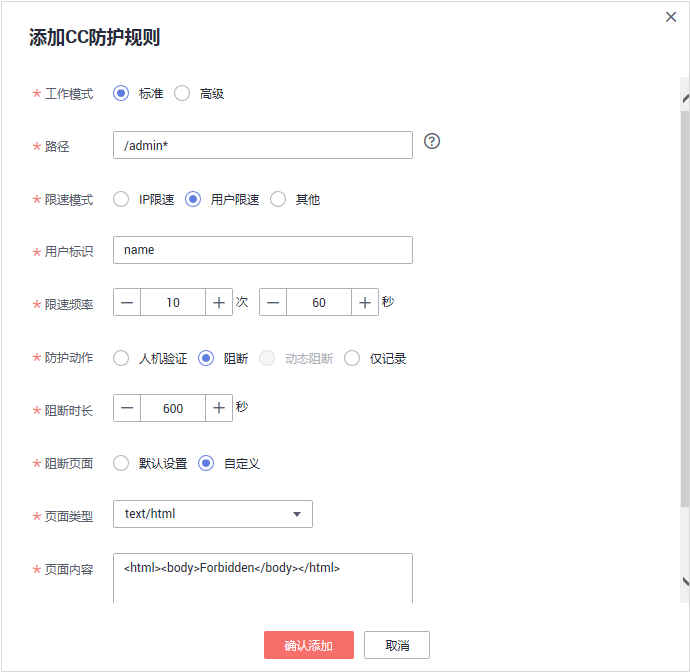

# 配置CC攻击防护规则

该任务指导用户通过Web应用防火墙服务配置CC（Challenge Collapsar）攻击防护规则。

CC攻击防护规则根据IP、Cookie或者Referer字段设置灵活的限速策略，精准识别CC攻击以及有效缓解CC攻击。

## 前提条件

-   已获取管理控制台的帐号和密码。
-   已添加防护域名。

## 操作步骤

1.  登录管理控制台（https://console.huaweicloud.com/）。
2.  单击管理控制台左上角的，选择区域或项目。
3.  单击页面上方的“服务列表“，选择“安全  \>  Web应用防火墙“，在左侧导航树中选择“域名配置“，进入“域名配置“页面，如[图1](#waf_01_0008_fig164792010154510)所示。

    **图 1**  域名配置页面  
    

4.  在目标域名所在行的“防护策略“栏中，单击“配置防护策略“，进入“防护配置“页面。
5.  在“CC攻击防护“配置框中，设置“状态“为开启状态，单击“自定义CC攻击防护规则“，进入CC防护规则配置页面，如[图2](#fig102851827142620)所示。

    **图 2**  CC防护规则配置框  
    

6.  在“CC防护“规则配置页面左上角，单击“添加规则“，如[图3](#fig1049724651413)所示。

    **图 3**  添加规则  
    

7.  在弹出的对话框中，添加CC防护规则，如[图4](#fig8736181862118)所示，请根据[表1](#table19744111819217)配置参数。

    **图 4**  添加CC防护规则  
    

    **表 1**  CC防护规则参数说明

    
    <table><thead align="left"><tr id="row137372018152111"><th class="cellrowborder" valign="top" width="19%" id="mcps1.2.4.1.1">
参数

    </th>
    <th class="cellrowborder" valign="top" width="50.88%" id="mcps1.2.4.1.2">
参数说明

    </th>
    <th class="cellrowborder" valign="top" width="30.12%" id="mcps1.2.4.1.3">
取值样例

    </th>
    </tr>
    </thead>
    <tbody><tr id="row1373871812117"><td class="cellrowborder" valign="top" width="19%" headers="mcps1.2.4.1.1 ">
路径

    </td>
    <td class="cellrowborder" valign="top" width="50.88%" headers="mcps1.2.4.1.2 ">
CC防护的URL链接，不包含域名。

    <ul id="ul1515617591337"><li>前缀匹配：以*结尾代表以该路径为前缀。例如，需要防护的路径为“/admin/test.php”或 “/adminabc”，则路径可以填写为“/admin*”。</li><li>精准匹配：需要防护的路径需要与此处填写的路径完全相等。例如，需要防护的路径为“/admin”，该规则必须填写为“/admin”。</li></ul>
    
 说明： 
<ul id="ul20707155819344"><li>该路径不支持正则，仅支持前缀匹配和精准匹配的逻辑。</li><li>路径里不能含有连续的多条斜线的配置，如“///admin”，WAF引擎会将“///”转为“/”。</li></ul>
    

    </td>
    <td class="cellrowborder" valign="top" width="30.12%" headers="mcps1.2.4.1.3 ">
/admin*

    </td>
    </tr>
    <tr id="row1773971812119"><td class="cellrowborder" valign="top" width="19%" headers="mcps1.2.4.1.1 ">
防护模式

    </td>
    <td class="cellrowborder" valign="top" width="50.88%" headers="mcps1.2.4.1.2 "><ul id="ul77394180214"><li>IP限速：根据IP区分单个Web访问者。</li><li>用户限速：根据Cookie键值区分单个Web访问者。</li><li>其他：根据Referer（自定义请求访问的来源）字段区分单个Web访问者。
 说明： 

当“防护模式”选择“其他”时，“Referer”对应的“内容”填写为包含域名的完整URL链接，仅支持前缀匹配和精准匹配的逻辑，“内容”里不能含有连续的多条斜线的配置，如“///admin”，WAF引擎会将“///”转为“/”。

    
例如：防护路径设置为“/admin”，若用户不希望访问者从“www.test.com”访问该页面，则“Referer”对应的“Content”设置为“http://www.test.com”

    

    </li></ul>
    </td>
    <td class="cellrowborder" valign="top" width="30.12%" headers="mcps1.2.4.1.3 ">
用户限速

    </td>
    </tr>
    <tr id="row8739818162118"><td class="cellrowborder" valign="top" width="19%" headers="mcps1.2.4.1.1 ">
用户标识

    </td>
    <td class="cellrowborder" valign="top" width="50.88%" headers="mcps1.2.4.1.2 ">
“防护模式”选择“用户限速”时，需要设置Cookie字段名，即用户需要根据网站实际情况配置唯一可识别Web访问者的Cookie中的某属性变量名，用户标识的Cookie，不支持正则，必须完全匹配。如果用户没有设置Cookie键值，WAF会自动分配一个值。

    
例如：如果网站使用Cookie中的某个字段，name唯一标识用户，那么可以选取name字段来区分Web访问者。

    </td>
    <td class="cellrowborder" valign="top" width="30.12%" headers="mcps1.2.4.1.3 ">
name

    </td>
    </tr>
    <tr id="row0741101862119"><td class="cellrowborder" valign="top" width="19%" headers="mcps1.2.4.1.1 ">
限速频率

    </td>
    <td class="cellrowborder" valign="top" width="50.88%" headers="mcps1.2.4.1.2 ">
单个Web访问者在限速周期内可以正常访问的次数，如果超过该访问次数，Web应用防火墙服务将暂停该Web访问者的访问。

    </td>
    <td class="cellrowborder" valign="top" width="30.12%" headers="mcps1.2.4.1.3 ">
10次/60秒

    </td>
    </tr>
    <tr id="row6741418122113"><td class="cellrowborder" valign="top" width="19%" headers="mcps1.2.4.1.1 ">
防护动作

    </td>
    <td class="cellrowborder" valign="top" width="50.88%" headers="mcps1.2.4.1.2 ">
当访问超过限制频率时，进行“人机验证”或者“阻断”。

    <ul id="ul374111183213"><li class="MsoBodyText">人机验证：表示在指定时间内访问超过次数限制后弹出验证码，进行人机验证，完成验证后，请求将不受访问限制。</li><li class="MsoBodyText">阻断：表示在指定时间内访问超过次数限制将直接阻断。
 说明： 

当“防护模式”选择“其他”时，“防护动作”只能选择“阻断”。

    

    </li></ul>
    </td>
    <td class="cellrowborder" valign="top" width="30.12%" headers="mcps1.2.4.1.3 ">
阻断

    </td>
    </tr>
    <tr id="row1274120181210"><td class="cellrowborder" valign="top" width="19%" headers="mcps1.2.4.1.1 ">
阻断时长

    </td>
    <td class="cellrowborder" valign="top" width="50.88%" headers="mcps1.2.4.1.2 ">
当“防护动作”选择“阻断”时，可设置阻断后恢复正常访问页面的时间。

    </td>
    <td class="cellrowborder" valign="top" width="30.12%" headers="mcps1.2.4.1.3 ">
600秒

    </td>
    </tr>
    <tr id="row8744101812218"><td class="cellrowborder" valign="top" width="19%" headers="mcps1.2.4.1.1 ">
阻断页面

    </td>
    <td class="cellrowborder" valign="top" width="50.88%" headers="mcps1.2.4.1.2 ">
当“防护动作”选择“阻断”时，需要设置，即当访问超过限速频率时，返回的错误页面。

    <ul id="ul15743111812116"><li>当选择“默认设置”时，返回的错误页面为系统默认的阻断页面。</li><li>当选择“自定义”，返回错误信息由用户自定义。</li></ul>
    </td>
    <td class="cellrowborder" valign="top" width="30.12%" headers="mcps1.2.4.1.3 ">
自定义

    </td>
    </tr>
    <tr id="row157442018202118"><td class="cellrowborder" valign="top" width="19%" headers="mcps1.2.4.1.1 ">
页面类型

    </td>
    <td class="cellrowborder" valign="top" width="50.88%" headers="mcps1.2.4.1.2 ">
当“阻断页面”选择“自定义”时，可选择阻断页面的类型“application/json”、“text/html”或者“text/xml”。

    </td>
    <td class="cellrowborder" valign="top" width="30.12%" headers="mcps1.2.4.1.3 ">
text/html

    </td>
    </tr>
    <tr id="row1574471819217"><td class="cellrowborder" valign="top" width="19%" headers="mcps1.2.4.1.1 ">
页面内容

    </td>
    <td class="cellrowborder" valign="top" width="50.88%" headers="mcps1.2.4.1.2 ">
当“阻断页面”选择“自定义”时，可设置自定义返回的内容。

    </td>
    <td class="cellrowborder" valign="top" width="30.12%" headers="mcps1.2.4.1.3 ">
&lt;html&gt;&lt;body&gt;Forbidden&lt;/body&gt;&lt;/html&gt;

    </td>
    </tr>
    </tbody>
    </table>

8.  单击“确认添加“，在页面右上角弹出“添加成功“，添加的CC攻击防护规则展示在CC规则列表中。
    -   若需要修改添加的CC攻击防护规则时，可单击待修改的CC攻击防护规则所在行的“修改“，修改CC攻击防护规则。
    -   若需要删除用户自行添加的CC攻击防护规则时，可单击待删除的CC攻击防护规则所在行的“删除“，删除CC攻击防护规则。

