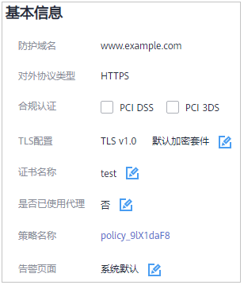

# 配置TLS最低版本和加密套件

安全传输层协议（Transport Layer Security，TLS）在两个通信应用程序之间提供保密性和数据完整性。HTTPS协议是由TLS+HTTP协议构建的可进行加密传输、身份认证的网络协议，当防护域名的“对外协议“为“HTTPS“时，您可以通过WAF为域名提供设置最低TLS版本和加密套件（多种加密算法的集合）功能，对于低于最低TLS版本的请求，将无法正常访问域名，以满足行业客户的安全需求。

当防护域名的“对外协议“为“HTTP“时，HTTP协议不涉及TLS，请忽略该章节。

WAF默认配置的最低TLS版本为TLS v1.0，加密套件为默认加密套件（安全性一般），为了确保域名安全，建议您将域名的最低TLS版本和TLS加密套件配置为安全性更高TLS版本和加密套件。

## 前提条件

-   已添加防护域名。
-   防护域名的“对外协议“使用了HTTPS协议。

## 操作步骤

1.  [登录管理控制台](https://console.huaweicloud.com/?locale=zh-cn)。
2.  进入域名配置页面入口，如[图1](#waf_01_0002_fig172535820151)所示。

    **图 1**  域名列表入口  
    

3.  在目标域名所在行的“防护域名“列中，单击目标域名，进入域名基本信息页面。
4.  在“TLS配置“所在行，单击，如[图2](#fig139001072302)所示。

    **图 2**  修改TLS配置  
    

5.  在弹出的“TLS配置“对话框中，选择最低TLS版本和加密套件，如[图3](#fig1518314493518)所示。

    **图 3** “TLS配置“对话框  
    

    -   选择“最低TLS版本“
        -   默认为TLS v1.0版本，TLS v1.0及以上版本的请求可以访问域名。
        -   选择TLS v1.1版本时，TLS v1.1及以上版本的请求可以访问域名。
        -   选择TLS v1.2版本时，TLS v1.2及以上版本的请求可以访问域名。

    -   选择“加密套件选择“
        -   默认加密套件：默认配置，兼容性较好，支持的客户端较为广泛，安全性一般。
        -   加密套件1：推荐的安全配置，兼顾兼容性。
        -   加密套件2：严格符合PCI DSS的FS要求，较低版本浏览器可能无法访问。
        -   加密套件3：支持ECDHE、DHE-GCM、RSA-AES-GCM，不支持CBC算法。

6.  单击“确定“，TLS配置完成。

