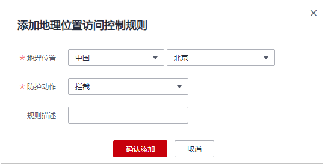

# 配置地理位置访问控制规则

您可以通过Web应用防火墙服务配置地理位置访问控制规则。可针对指定国家、地区的来源IP自定义访问控制。

> **说明：**   
>只有WAF企业版和旗舰版才支持该规则。如果您是专业版用户，建议您升级服务版本。  

## 前提条件

-   已获取管理控制台的账号和密码。
-   已添加防护域名。

## 操作步骤

1.  [登录管理控制台](https://console.huaweicloud.com/?locale=zh-cn)。
2.  进入防护配置入口，如[图1](#zh-cn_topic_0110861309_fig089771664710)所示。

    **图 1**  防护配置入口  
    

3.  在“地理位置访问控制“配置框中，用户可根据自己的需要更改“状态“，单击“自定义地理位置访问控制规则“，进入“地理位置访问控制“页面，如[图2](#fig1841026151810)所示。

    **图 2**  地理位置访问控制配置框  
    

4.  在“地理位置访问控制“页面左上角，单击“添加规则“。
5.  在弹出的对话框，添加地理位置访问控制规则，如[图3](#fig49385421125519)所示，根据[表1](#table4696626918715)配置参数。

    **图 3**  添加地理位置访问控制规则  
    

    **表 1**  添加地理位置访问控制规则参数说明

    
    <table><thead align="left"><tr id="row151760118715"><th class="cellrowborder" valign="top" width="19%" id="mcps1.2.4.1.1">
参数

    </th>
    <th class="cellrowborder" valign="top" width="49%" id="mcps1.2.4.1.2">
参数说明

    </th>
    <th class="cellrowborder" valign="top" width="32%" id="mcps1.2.4.1.3">
取值样例

    </th>
    </tr>
    </thead>
    <tbody><tr id="row125751318715"><td class="cellrowborder" valign="top" width="19%" headers="mcps1.2.4.1.1 ">
地理位置

    </td>
    <td class="cellrowborder" valign="top" width="49%" headers="mcps1.2.4.1.2 ">
IP访问的地理范围。

    </td>
    <td class="cellrowborder" valign="top" width="32%" headers="mcps1.2.4.1.3 ">
“中国”，“北京”

    </td>
    </tr>
    <tr id="row3251580618715"><td class="cellrowborder" valign="top" width="19%" headers="mcps1.2.4.1.1 ">
防护动作

    </td>
    <td class="cellrowborder" valign="top" width="49%" headers="mcps1.2.4.1.2 ">
可以根据需要选择“拦截”、“放行”或者“仅记录”。

    </td>
    <td class="cellrowborder" valign="top" width="32%" headers="mcps1.2.4.1.3 ">
“拦截”

    </td>
    </tr>
    <tr id="row1389601714612"><td class="cellrowborder" valign="top" width="19%" headers="mcps1.2.4.1.1 ">
规则描述

    </td>
    <td class="cellrowborder" valign="top" width="49%" headers="mcps1.2.4.1.2 ">
可选参数，设置该规则的备注信息。

    </td>
    <td class="cellrowborder" valign="top" width="32%" headers="mcps1.2.4.1.3 ">
--

    </td>
    </tr>
    </tbody>
    </table>

6.  单击“确认添加“，添加的地理位置访问控制规则展示在地理位置访问控制规则列表中。

    **图 4**  地理位置规则列表  
    

    -   规则添加成功后，默认的“规则状态“为“已开启“，若您暂时不想使该规则生效，可在目标规则所在行的“操作“列，单击“关闭“。
    -   若需要修改添加的地理位置访问控制规则时，可单击待修改的地理位置访问控制规则所在行的“修改“，修改地理位置访问控制规则。
    -   若需要删除添加的地理位置访问控制规则时，可单击待删除的地理位置访问控制规则所在行的“删除“，删除地理位置访问控制规则。

## 防护效果

假如已添加域名“www.example.com“。可参照以下步骤验证防护效果：

1.  清理浏览器缓存，在浏览器中输入防护域名，测试网站域名是否能正常访问。
    -   不能正常访问，参照[域名接入WAF](zh-cn_topic_0125242653.md)章节重新完成域名接入。
    -   能正常访问，执行[2](#li885731953512)。

2.  参照[操作步骤](#section61533550183130)，将您的客户端IP来源地配置为拦截，如“中国““四川“。
3.  清理浏览器缓存，在浏览器中访问“http://www.example.com“页面，正常情况下，WAF会阻断该来源地IP的访问请求，返回拦截页面。
4.  返回Web应用防火墙控制界面，在左侧导航树中，单击“防护事件“，进入“防护事件“页面，查看防护域名拦截日志，您也可以[下载防护事件数据](下载防护事件数据.md)。

