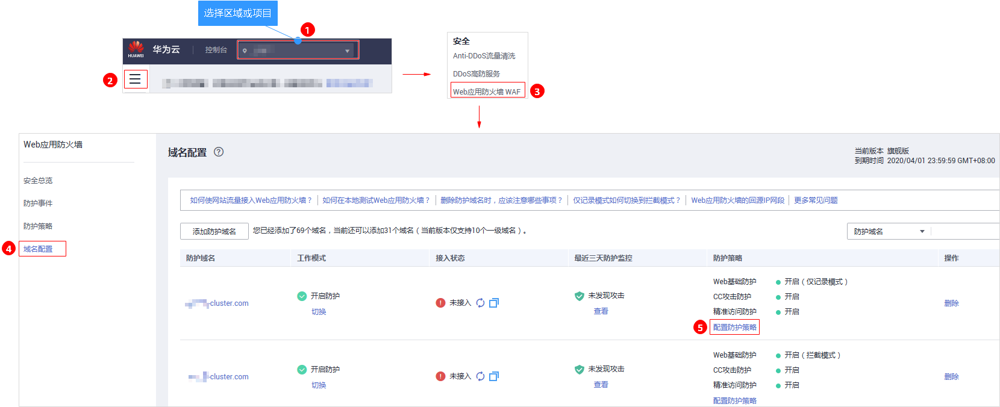
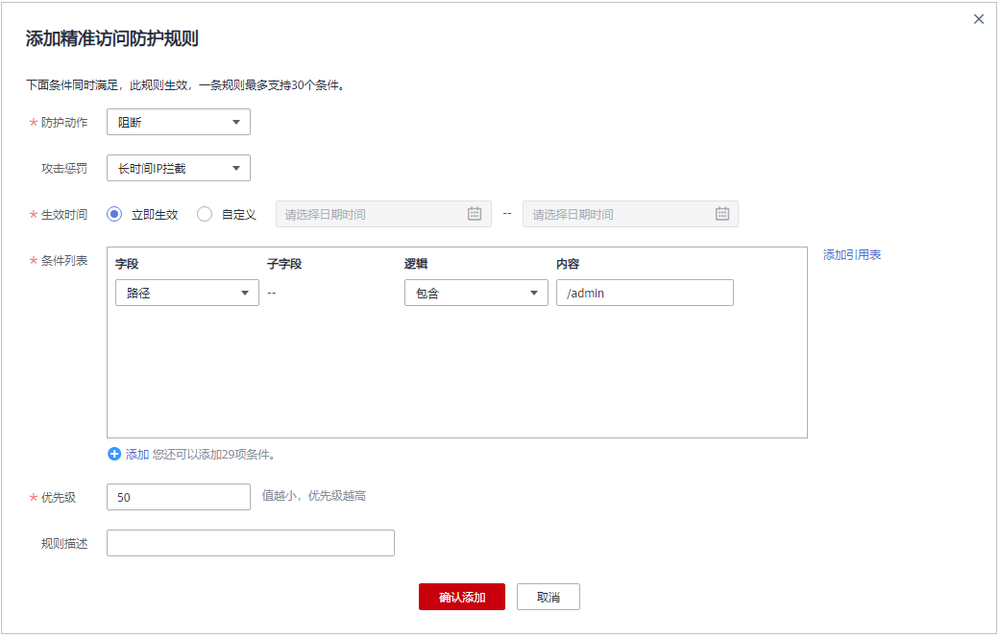

# 配置精准访问防护规则

精准访问防护策略可对HTTP首部、Cookie、访问URL、请求参数或者客户端IP进行条件组合，定制化防护策略，为您的网站带来更精准的防护。

精准访问防护规则允许您设置访问防护规则，对常见的HTTP字段（如IP、路径、Referer、User Agent、Params等）进行条件组合，用来筛选访问请求，并对命中条件的请求设置放行或阻断操作。精准访问防护支持业务场景定制化的防护策略，可用于盗链防护、网站管理后台保护等。

## 前提条件

-   已获取管理控制台的账号和密码。
-   已添加防护域名。

## 操作步骤

1.  [登录管理控制台](https://console.huaweicloud.com/?locale=zh-cn)。
2.  进入防护配置入口，如[图1](#waf_01_0008_fig089771664710)所示。

    **图 1**  防护配置入口  
    

3.  在“精准访问防护“配置框中，用户可根据自己的需要更改“状态“，单击“自定义精准访问防护规则“，进入精准访问防护规则配置页面，如[图2](#fig275911394277)所示。

    **图 2**  精准访问防护配置框  
    

4.  在“精准访问防护配置“页面，设置“检测模式“，如[图3](#fig1818193165213)所示。

    精准访问防护规则提供了两种检测模式：

    -   短路检测：当用户的请求符合精准防护中的拦截条件时，便立刻终止检测，进行拦截。
    -   全检测：当用户的请求符合精准防护中的拦截条件时，不会立即拦截，它会继续执行其他防护的检测，待其他防护的检测完成后进行拦截。

        **图 3**  检测模式  
        

5.  在“精准访问防护配置“页面左上角，单击“添加规则“。
6.  在弹出的对话框中，根据[表1](#table2299936310457)和[配置示例](#section293512615491)添加精准访问防护规则。

    以[图4](#fig39459217174738)的配置为例，其含义为：当用户访问目标域名下包含“/admin“的URL地址时，WAF将阻断该用户访问目标URL地址。

    **图 4**  添加精准访问防护规则  
    

    **表 1**  规则参数说明

    
    <table><thead align="left"><tr id="row6587906910457"><th class="cellrowborder" valign="top" width="14.34%" id="mcps1.2.4.1.1">
参数

    </th>
    <th class="cellrowborder" valign="top" width="51.22%" id="mcps1.2.4.1.2">
参数说明

    </th>
    <th class="cellrowborder" valign="top" width="34.44%" id="mcps1.2.4.1.3">
取值样例

    </th>
    </tr>
    </thead>
    <tbody><tr id="row985919110457"><td class="cellrowborder" valign="top" width="14.34%" headers="mcps1.2.4.1.1 ">
防护动作

    </td>
    <td class="cellrowborder" valign="top" width="51.22%" headers="mcps1.2.4.1.2 ">
可选择“阻断”、“放行”或者“仅记录”。默认为“阻断”。

    </td>
    <td class="cellrowborder" valign="top" width="34.44%" headers="mcps1.2.4.1.3 ">
“阻断”

    </td>
    </tr>
    <tr id="row67041622103812"><td class="cellrowborder" valign="top" width="14.34%" headers="mcps1.2.4.1.1 ">
生效时间

    </td>
    <td class="cellrowborder" valign="top" width="51.22%" headers="mcps1.2.4.1.2 ">
用户可以选择“立即生效”或者自定义设置生效时间段。

    
自定义设置的时间只能为将来的某一时间段。

    </td>
    <td class="cellrowborder" valign="top" width="34.44%" headers="mcps1.2.4.1.3 ">
“立即生效”

    </td>
    </tr>
    <tr id="row601487010457"><td class="cellrowborder" valign="top" width="14.34%" headers="mcps1.2.4.1.1 ">
条件列表

    </td>
    <td class="cellrowborder" valign="top" width="51.22%" headers="mcps1.2.4.1.2 ">
单击“添加”增加新的条件，一个防护规则至少包含一项条件，最多可添加30项条件，多个条件同时满足时，本条规则才生效。<ul id="ul61829843104748"><li>字段</li><li>子字段：当字段选择“Params”、“Cookie”或者“Header”时，请根据实际使用需求配置子字段。
 须知： 

子字段的长度不能超过2048字节，且只能由数字、字母、下划线和中划线组成。

    

    </li><li>逻辑：在“逻辑”下拉列表中选择需要的逻辑关系。
 说明： 

当“逻辑”关系选择“包含任意一个”、“不包含所有”、“等于任意一个”、“不等于所有”、“前缀为任意一个”、“前缀不为所有”、“后缀为任意一个”或者“后缀不为所有”时，需要选择引用表，创建引用表的详细操作请参见<a href="创建引用表.md">创建引用表</a>。

    

    </li><li>内容：输入或者选择条件匹配的内容。</li></ul>
    

    
 说明： 

具体的配置请参见<a href="#table13543174312394">表2</a>。

    

    </td>
    <td class="cellrowborder" valign="top" width="34.44%" headers="mcps1.2.4.1.3 "><ul id="ul13199878104428"><li>“路径”包含“/admin/”</li><li>“User Agent”前缀不为“mozilla/5.0”</li><li>“IP”等于“192.168.2.3”</li><li>“Cookie[key1]”前缀不为“Nessus”</li></ul>
    </td>
    </tr>
    <tr id="row1662111271019"><td class="cellrowborder" valign="top" width="14.34%" headers="mcps1.2.4.1.1 ">
优先级

    </td>
    <td class="cellrowborder" valign="top" width="51.22%" headers="mcps1.2.4.1.2 ">
设置该条件规则检测的顺序值。如果您设置了多条规则，则多条规则间有先后匹配顺序，即访问请求将根据您设定的精准访问控制规则顺序依次进行匹配，优先级较小的精准访问控制规则优先匹配。

    
您可以通过优先级功能对所有精准访问控制规则进行排序，以获得最优的防护效果。

    </td>
    <td class="cellrowborder" valign="top" width="34.44%" headers="mcps1.2.4.1.3 ">
5

    </td>
    </tr>
    <tr id="row1749220184218"><td class="cellrowborder" valign="top" width="14.34%" headers="mcps1.2.4.1.1 ">
规则描述

    </td>
    <td class="cellrowborder" valign="top" width="51.22%" headers="mcps1.2.4.1.2 ">
可选参数，设置该规则的备注信息。

    </td>
    <td class="cellrowborder" valign="top" width="34.44%" headers="mcps1.2.4.1.3 ">
--

    </td>
    </tr>
    </tbody>
    </table>

    **表 2**  条件列表配置

    
    <table><thead align="left"><tr id="row4545174315393"><th class="cellrowborder" valign="top" width="20.71792820717928%" id="mcps1.2.5.1.1">
字段

    </th>
    <th class="cellrowborder" valign="top" width="25.35746425357464%" id="mcps1.2.5.1.2">
子字段（举例）

    </th>
    <th class="cellrowborder" valign="top" width="28.947105289471054%" id="mcps1.2.5.1.3">
逻辑

    </th>
    <th class="cellrowborder" valign="top" width="24.97750224977502%" id="mcps1.2.5.1.4">
内容（举例）

    </th>
    </tr>
    </thead>
    <tbody><tr id="row1545114318391"><td class="cellrowborder" valign="top" width="20.71792820717928%" headers="mcps1.2.5.1.1 ">
路径：设置的防护路径，不包含域名，仅支持精准匹配（需要防护的路径需要与此处填写的路径完全相等。例如，需要防护的路径为“/admin”，该规则必须填写为“/admin”）

    </td>
    <td class="cellrowborder" valign="top" width="25.35746425357464%" headers="mcps1.2.5.1.2 ">
--

    </td>
    <td class="cellrowborder" valign="top" width="28.947105289471054%" headers="mcps1.2.5.1.3 ">
在下拉列表中选择需要的逻辑关系。

    </td>
    <td class="cellrowborder" valign="top" width="24.97750224977502%" headers="mcps1.2.5.1.4 ">
<i>/buy/phone/</i>

    </td>
    </tr>
    <tr id="row362081410432"><td class="cellrowborder" valign="top" width="20.71792820717928%" headers="mcps1.2.5.1.1 ">
User Agent：设置为需要防护的扫描器的用户代理。

    </td>
    <td class="cellrowborder" valign="top" width="25.35746425357464%" headers="mcps1.2.5.1.2 ">
--

    </td>
    <td class="cellrowborder" valign="top" width="28.947105289471054%" headers="mcps1.2.5.1.3 ">
在下拉列表中选择需要的逻辑关系。

    </td>
    <td class="cellrowborder" valign="top" width="24.97750224977502%" headers="mcps1.2.5.1.4 ">
<i>Mozilla/5.0 (Windows NT 6.1)</i>

    </td>
    </tr>
    <tr id="row323411238439"><td class="cellrowborder" valign="top" width="20.71792820717928%" headers="mcps1.2.5.1.1 ">
IP：设置为需要防护的访问者IP地址。

    
支持IPv4和IPv6两种格式的IP地址。

    
 须知： 

仅旗舰版支持IPv6。

    

    </td>
    <td class="cellrowborder" valign="top" width="25.35746425357464%" headers="mcps1.2.5.1.2 ">
--

    </td>
    <td class="cellrowborder" valign="top" width="28.947105289471054%" headers="mcps1.2.5.1.3 ">
在下拉列表中选择需要的逻辑关系。

    </td>
    <td class="cellrowborder" valign="top" width="24.97750224977502%" headers="mcps1.2.5.1.4 "><ul id="ul13143163612400"><li>IPv4，例如：192.168.1.1</li><li>IPv6，例如：1050:0:0:0:5:600:300c:326b</li></ul>
    </td>
    </tr>
    <tr id="row17545184303914"><td class="cellrowborder" valign="top" width="20.71792820717928%" headers="mcps1.2.5.1.1 ">
Params：设置为需要防护的请求参数。

    </td>
    <td class="cellrowborder" valign="top" width="25.35746425357464%" headers="mcps1.2.5.1.2 ">
sttl

    </td>
    <td class="cellrowborder" valign="top" width="28.947105289471054%" headers="mcps1.2.5.1.3 ">
在下拉列表中选择需要的逻辑关系。

    </td>
    <td class="cellrowborder" valign="top" width="24.97750224977502%" headers="mcps1.2.5.1.4 ">
201901150929

    </td>
    </tr>
    <tr id="row15281420164313"><td class="cellrowborder" valign="top" width="20.71792820717928%" headers="mcps1.2.5.1.1 ">
Cookie：根据Cookie区分的Web访问者。

    </td>
    <td class="cellrowborder" valign="top" width="25.35746425357464%" headers="mcps1.2.5.1.2 ">
name

    </td>
    <td class="cellrowborder" valign="top" width="28.947105289471054%" headers="mcps1.2.5.1.3 ">
在下拉列表中选择需要的逻辑关系。

    </td>
    <td class="cellrowborder" valign="top" width="24.97750224977502%" headers="mcps1.2.5.1.4 ">
Nessus

    </td>
    </tr>
    <tr id="row4281142015438"><td class="cellrowborder" valign="top" width="20.71792820717928%" headers="mcps1.2.5.1.1 ">
Referer：设置为需要防护的自定义请求访问的来源。

    
例如：防护路径设置为“/admin/xxx”，若用户不希望访问者从“www.test.com”访问该页面，则“Referer”对应的“内容”设置为“http://www.test.com”。

    </td>
    <td class="cellrowborder" valign="top" width="25.35746425357464%" headers="mcps1.2.5.1.2 ">
--

    </td>
    <td class="cellrowborder" valign="top" width="28.947105289471054%" headers="mcps1.2.5.1.3 ">
在下拉列表中选择需要的逻辑关系。

    </td>
    <td class="cellrowborder" valign="top" width="24.97750224977502%" headers="mcps1.2.5.1.4 ">
http://www.test.com

    </td>
    </tr>
    <tr id="row22811220114314"><td class="cellrowborder" valign="top" width="20.71792820717928%" headers="mcps1.2.5.1.1 ">
Header：设置为需要防护的自定义HTTP首部。

    </td>
    <td class="cellrowborder" valign="top" width="25.35746425357464%" headers="mcps1.2.5.1.2 ">
Accept

    </td>
    <td class="cellrowborder" valign="top" width="28.947105289471054%" headers="mcps1.2.5.1.3 ">
在下拉列表中选择需要的逻辑关系。

    </td>
    <td class="cellrowborder" valign="top" width="24.97750224977502%" headers="mcps1.2.5.1.4 ">
<i>text/html,application/xhtml+xml,application/xml;q=0.9,image/webp,image/apng,*/*;q=0.8</i>

    </td>
    </tr>
    <tr id="row8327101912481"><td class="cellrowborder" valign="top" width="20.71792820717928%" headers="mcps1.2.5.1.1 ">
Method：需要防护的自定义请求的方法。

    </td>
    <td class="cellrowborder" valign="top" width="25.35746425357464%" headers="mcps1.2.5.1.2 ">
--

    </td>
    <td class="cellrowborder" valign="top" width="28.947105289471054%" headers="mcps1.2.5.1.3 ">
在下拉列表中选择需要的逻辑关系。

    </td>
    <td class="cellrowborder" valign="top" width="24.97750224977502%" headers="mcps1.2.5.1.4 ">
GET、POST、PUT、DELETE、PATCH

    </td>
    </tr>
    <tr id="row37275297488"><td class="cellrowborder" valign="top" width="20.71792820717928%" headers="mcps1.2.5.1.1 ">
Request Line：需要防护的自定义请求行的长度。

    </td>
    <td class="cellrowborder" valign="top" width="25.35746425357464%" headers="mcps1.2.5.1.2 ">
--

    </td>
    <td class="cellrowborder" valign="top" width="28.947105289471054%" headers="mcps1.2.5.1.3 ">
在下拉列表中选择需要的逻辑关系。

    </td>
    <td class="cellrowborder" valign="top" width="24.97750224977502%" headers="mcps1.2.5.1.4 ">
50

    </td>
    </tr>
    <tr id="row13028247483"><td class="cellrowborder" valign="top" width="20.71792820717928%" headers="mcps1.2.5.1.1 ">
Request：需要防护的自定义请求的长度。包含请求头、请求行、请求体。

    </td>
    <td class="cellrowborder" valign="top" width="25.35746425357464%" headers="mcps1.2.5.1.2 ">
--

    </td>
    <td class="cellrowborder" valign="top" width="28.947105289471054%" headers="mcps1.2.5.1.3 ">
在下拉列表中选择需要的逻辑关系。

    </td>
    <td class="cellrowborder" valign="top" width="24.97750224977502%" headers="mcps1.2.5.1.4 ">
--

    </td>
    </tr>
    </tbody>
    </table>

7.  单击“确认添加“，添加的精准访问防护规则展示在精准访问防护规则列表中。

    **图 5**  精准访问防护规则列表  
    

    -   规则添加成功后，默认的“规则状态“为“已开启“，若您暂时不想使该规则生效，可在目标规则所在行的“操作“列，单击“关闭“。
    -   若需要修改添加的精准访问防护规则时，可单击待修改的精准访问防护规则所在行的“修改“，修改精准访问防护规则。
    -   若需要删除添加的精准访问防护规则时，可单击待删除的精准访问防护规则所在行的“删除“，删除精准访问防护规则。

## 防护效果

假如已添加域名“www.example.com“，且配置了如[图4](#fig39459217174738)所示的精准访问防护规则。可参照以下步骤验证防护效果：

1.  清理浏览器缓存，在浏览器中输入防护域名，测试网站域名是否能正常访问。
    -   不能正常访问，参照[域名接入](域名接入.md)章节重新完成域名接入。
    -   能正常访问，执行[2](#li1160182620213)。

2.  清理浏览器缓存，在浏览器中访问“http://www.example.com/admin“页面或者包含/admin的任意页面，正常情况下，WAF会阻断满足条件的访问请求，返回拦截页面。
3.  返回Web应用防火墙控制界面，在左侧导航树中，单击“防护事件“，进入“防护事件“页面，查看防护域名拦截日志，您也可以[下载防护事件数据](下载防护事件数据.md)。

## 配置示例

精准访问控制规则支持多种配置方法，您可以结合自身业务特点定义相应的规则。以下罗列了常用的精准访问防护规则的配置示例，供您参考。

-   拦截特定的攻击请求

    通过分析某类特定的WordPress反弹攻击，发现其特征是User-Agent字段都包含WordPress，如[图6](#fig16451834185616)所示。

    **图 6**  WordPress反弹攻击  
    

    因此，可以设置以下精准访问控制规则，拦截该类WordPress反弹攻击请求。

    **图 7**  User Agent配置  
    

-   阻断特定的URL请求

    如果您遇到有大量IP在访问某个特定且不存在的URL，您可以通过配置以下精准访问防护规则直接阻断所有该类请求，降低源站服务器的资源消耗，如[图8](#fig206711023191118)所示。

    **图 8**  特定的URL拦截  
    

-   防盗链

    通过配置Referer匹配字段的访问控制规则，您可以阻断特定网站的盗链。例如，您发现“https://abc.blog.com“大量盗用本站的图片，您可以配置以下精准访问防护规则阻断相关访问请求。

    **图 9**  防盗链  
    

-   单独放行指定IP的访问

    配置两条精准访问防护规则，一条拦截所有的请求，如[图10](#fig1391664412484)所示，一条单独放行指定IP的访问，如[图11](#fig1393117824920)所示。

    **图 10**  阻断所有的请求  
    

    **图 11**  放行指定IP  
    

