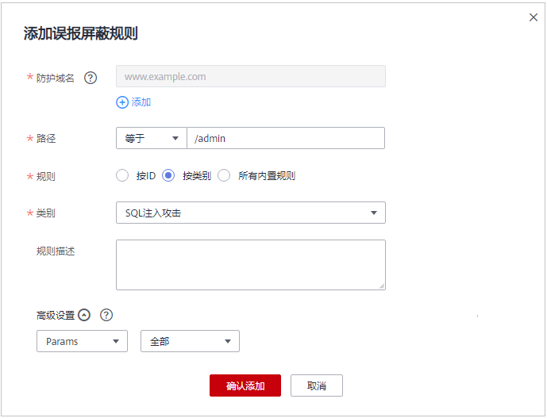

# 配置误报屏蔽规则

该章节指导您通过Web应用防火墙服务配置误报屏蔽规则。

对于误报情况，可以添加白名单对误报进行忽略，对某些规则ID或者事件类别进行忽略设置（例如，某URL不进行XSS的检查，可设置屏蔽规则，屏蔽XSS检查）。

## 前提条件

-   已获取管理控制台的账号和密码。
-   已添加防护域名。

## 操作步骤

1.  [登录管理控制台](https://console.huaweicloud.com/&locale=zh-cn)。
2.  进入防护配置入口，如[图1](#waf_01_0008_fig089771664710)所示。

    **图 1**  防护配置入口  
    

3.  在“误报屏蔽“配置框中，用户可根据自己的需要更改“状态“，单击“自定义误报屏蔽规则“，进入“误报屏蔽“规则配置页面，如[图2](#fig44151977327)所示。

    **图 2**  误报屏蔽配置框  
    

4.  在“误报屏蔽“规则配置页面左上角，单击“添加规则“。
5.  添加误报屏蔽规则，如[图3](#fig14415389105236)所示，参数说明如[表1](#table4696626918715)所示。

    **图 3**  添加误报屏蔽规则  
    

    **表 1**  添加误报屏蔽规则参数说明

    
    <table><thead align="left"><tr id="row151760118715"><th class="cellrowborder" valign="top" width="23.84%" id="mcps1.2.4.1.1">
参数

    </th>
    <th class="cellrowborder" valign="top" width="44.12%" id="mcps1.2.4.1.2">
参数说明

    </th>
    <th class="cellrowborder" valign="top" width="32.04%" id="mcps1.2.4.1.3">
取值样例

    </th>
    </tr>
    </thead>
    <tbody><tr id="row125751318715"><td class="cellrowborder" valign="top" width="23.84%" headers="mcps1.2.4.1.1 ">
路径

    </td>
    <td class="cellrowborder" valign="top" width="44.12%" headers="mcps1.2.4.1.2 ">
误报路径，完整的URL链接，不包含域名。

    <ul id="ul1515617591337"><li>前缀匹配：以*结尾代表以该路径为前缀。例如，需要防护的路径为“/admin/test.php”或 “/adminabc”，则路径可以填写为“/admin*”。</li><li>精准匹配：需要防护的路径需要与此处填写的路径完全相等。例如，需要防护的路径为“/admin”，该规则必须填写为“/admin”。</li></ul>
    
 说明： 
<ul id="ul20707155819344"><li>该路径不支持正则，仅支持前缀匹配和精准匹配的逻辑。</li><li>路径里不能含有连续的多条斜线的配置，如“///admin”，访问时，引擎会将“///”转为“/”。</li></ul>
    

    </td>
    <td class="cellrowborder" valign="top" width="32.04%" headers="mcps1.2.4.1.3 ">
/admin*

    
针对特定的攻击事件类型，可参照下面三种情形进行配置：

    <ul id="ul294417207388"><li>如果您需要配置目标域名下所有的页面都放行，即针对特定攻击类型都不拦截，则“路径”设置为“/*”。</li><li>如果您需要配置目标域名下包含特定信息的页面不拦截，例如，包含“admin”的页面不拦截，则“路径”设置为“/admin*”。</li><li>如果您需要配置目标域名下只针对特定路径的页面不拦截，例如，域名下的“/amin”页面不拦截，则“路径”设置为“/admin”。</li></ul>
    </td>
    </tr>
    <tr id="row3251580618715"><td class="cellrowborder" valign="top" width="23.84%" headers="mcps1.2.4.1.1 ">
规则编号

    </td>
    <td class="cellrowborder" valign="top" width="44.12%" headers="mcps1.2.4.1.2 ">
“防护事件”列表中事件类型为非“自定义规则”的攻击事件所对应的规则编号。

    
可单击该攻击事件所在行的“误报处理”获取规则编号。

    
由6位数字组成，不能为空。

    </td>
    <td class="cellrowborder" valign="top" width="32.04%" headers="mcps1.2.4.1.3 ">
000006

    </td>
    </tr>
    <tr id="row11241112714318"><td class="cellrowborder" valign="top" width="23.84%" headers="mcps1.2.4.1.1 ">
规则描述

    </td>
    <td class="cellrowborder" valign="top" width="44.12%" headers="mcps1.2.4.1.2 ">
可选参数，设置该规则的备注信息。

    </td>
    <td class="cellrowborder" valign="top" width="32.04%" headers="mcps1.2.4.1.3 ">
--

    </td>
    </tr>
    </tbody>
    </table>

6.  单击“确认添加“，添加的误报屏蔽规则展示在误报屏蔽规则列表中。

    **图 4**  误报屏蔽规则列表  
    

    -   规则添加成功后，默认的“规则状态“为“已开启“，若您暂时不想使该规则生效，可在目标规则所在行的“操作“列，单击“关闭“。
    -   若需要删除添加的误报屏蔽规则时，可单击待删除的误报屏蔽规则所在行的“删除“，删除误报屏蔽规则。

