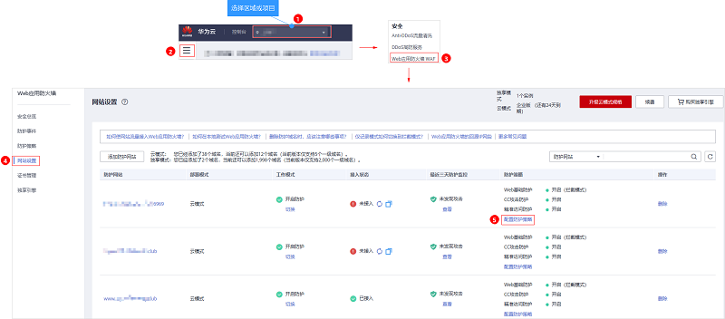
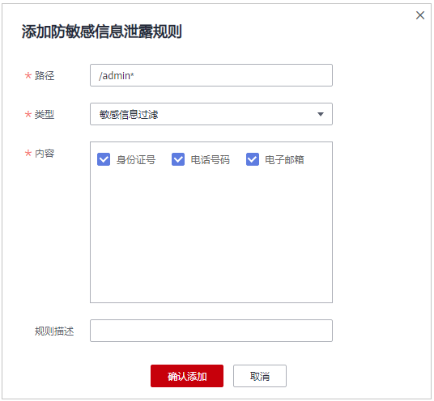
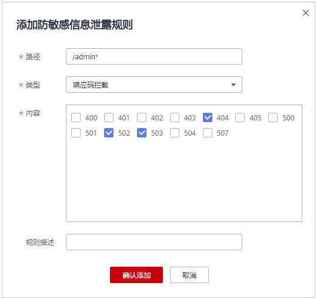

# 配置防敏感信息泄露规则

您可以添加两种类型的防敏感信息泄露规则：

-   敏感信息过滤。配置后可对返回页面中包含的敏感信息做屏蔽处理，防止用户的敏感信息（例如：身份证号、电话号码、电子邮箱等）泄露。
-   响应码拦截。配置后可拦截指定的HTTP响应码页面。

> **须知：**   
>仅企业版、旗舰版和独享版支持该规则。  

## 前提条件

已添加防护网站。

## 操作步骤

1.  [登录管理控制台](https://console.huaweicloud.com/?locale=zh-cn)。
2.  进入防护策略配置入口，如[图1](#waf_01_0008_fig089771664710)所示。

    **图 1**  防护策略配置入口  
    

3.  在“防敏感信息泄露“的配置框中，用户可根据自己的需要更改“状态“，单击“自定义防敏感信息泄露规则“，进入“防敏感信息泄露“规则配置页面，如[图2](#fig1257034345115)所示。

    **图 2**  防敏感信息泄露配置框  
    

4.  在“防敏感信息泄露“规则配置页面左上角，单击“添加规则“。
5.  在弹出的对话框，添加防敏感信息泄露规则，如[图3](#fig1077215502209)和[图4](#fig134221027101710)所示，参数说明如[表1](#table242612276178)所示。

    “防敏感信息泄露“规则既能防止用户的敏感信息（例如：身份证号、电话号码、电子邮箱等）泄露，也能够拦截指定的HTTP响应码页面。

    敏感信息过滤：针对网站页面中可能存在的电话号码和身份证等敏感信息，配置相应的规则对其进行过滤。例如，您可以通过设置以下防护规则，过滤身份证号、电话号码和电子邮箱敏感信息。

    **图 3**  敏感信息泄露  
    

    状态码拦截：针对特定的HTTP请求状态码，可配置规则将其拦截，避免服务器敏感信息泄露。例如，您可以通过设置以下防护规则，拦截HTTP 404、502、503状态码。

    **图 4**  响应码拦截  
    

    **表 1**  参数说明

    
    <table><thead align="left"><tr id="row1942310273174"><th class="cellrowborder" valign="top" width="22%" id="mcps1.2.4.1.1">
参数名称

    </th>
    <th class="cellrowborder" valign="top" width="53%" id="mcps1.2.4.1.2">
参数说明

    </th>
    <th class="cellrowborder" valign="top" width="25%" id="mcps1.2.4.1.3">
取值样例

    </th>
    </tr>
    </thead>
    <tbody><tr id="row10424132716173"><td class="cellrowborder" valign="top" width="22%" headers="mcps1.2.4.1.1 ">
路径

    </td>
    <td class="cellrowborder" valign="top" width="53%" headers="mcps1.2.4.1.2 ">
需要过滤敏感信息（例如：身份证号、电话号码、电子邮箱等）或者拦截响应码的URL不包含域名的路径。

    <ul id="ul942442781712"><li>前缀匹配：填写的路径前缀与需要防护的路径相同即可。
如果防护路径为“/admin”，该规则填写为“/admin*”，该规则生效。

    </li><li>精准匹配：需要防护的路径需要与此处填写的路径完全相等。
如果防护路径为“/admin”，该规则必须填写为“/admin”。

    
 说明： 
<ul id="ul0424152720171"><li>该路径不支持正则，仅支持前缀匹配和精准匹配的逻辑。</li><li>路径里不能含有多条斜线的配置，如“///admin”，访问时，引擎会将“///”转为“/”。</li></ul>
    

    </li></ul>
    </td>
    <td class="cellrowborder" valign="top" width="25%" headers="mcps1.2.4.1.3 ">
/admin*

    </td>
    </tr>
    <tr id="row184251827121714"><td class="cellrowborder" valign="top" width="22%" headers="mcps1.2.4.1.1 ">
类型

    </td>
    <td class="cellrowborder" valign="top" width="53%" headers="mcps1.2.4.1.2 "><ul id="ul1442582716174"><li>敏感信息过滤：防止用户的敏感信息（例如：身份证号、电话号码、电子邮箱等）泄露。</li><li>响应码拦截：拦截指定的HTTP响应码页面。</li></ul>
    </td>
    <td class="cellrowborder" valign="top" width="25%" headers="mcps1.2.4.1.3 ">
敏感信息过滤

    </td>
    </tr>
    <tr id="row1426162712179"><td class="cellrowborder" valign="top" width="22%" headers="mcps1.2.4.1.1 ">
内容

    </td>
    <td class="cellrowborder" valign="top" width="53%" headers="mcps1.2.4.1.2 ">
防护“类型”对应的防护内容，支持多选。

    </td>
    <td class="cellrowborder" valign="top" width="25%" headers="mcps1.2.4.1.3 ">
身份证号码

    </td>
    </tr>
    <tr id="row19426192771717"><td class="cellrowborder" valign="top" width="22%" headers="mcps1.2.4.1.1 ">
规则描述

    </td>
    <td class="cellrowborder" valign="top" width="53%" headers="mcps1.2.4.1.2 ">
可选参数，设置该规则的备注信息。

    </td>
    <td class="cellrowborder" valign="top" width="25%" headers="mcps1.2.4.1.3 ">
--

    </td>
    </tr>
    </tbody>
    </table>

6.  单击“确认添加“，添加的防敏感信息泄露规则展示在防敏感信息泄露规则列表中。

    **图 5**  防敏感信息泄露规则列表  
    

    -   规则添加成功后，默认的“规则状态“为“已开启“，若您暂时不想使该规则生效，可在目标规则所在行的“操作“列，单击“关闭“。
    -   当您需要修改添加的防敏感信息泄露规则时，在待修改的防敏感信息泄露规则所在行，单击“修改“，修改防敏感信息泄露规则。
    -   当您需要删除添加的防敏感信息泄露规则时，在待删除的防敏感信息泄露规则所在行，单击“删除“，删除防敏感信息泄露规则。

