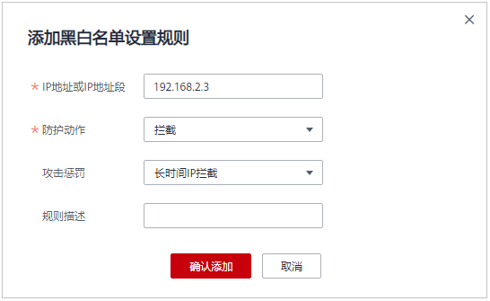

# 配置黑白名单规则

该任务指导用户通过Web应用防火墙服务配置黑白名单规则，阻断或放行指定IP的访问请求，即设置IP黑/白名单。

符合设置的黑白名单IP或者IP段规则，Web应用防火墙将拦截或者放行IP的访问。

IP黑白名单仅针对配置的特定域名生效。

## 前提条件

-   已获取管理控制台的帐号和密码。
-   已添加防护域名。

## 操作步骤

1.  登录管理控制台（https://console.huaweicloud.com/）。
2.  单击管理控制台左上角的，选择区域或项目。
3.  单击页面上方的“服务列表“，选择“安全  \>  Web应用防火墙“，在左侧导航树中选择“域名配置“，进入“域名配置“页面，如[图1](#waf_01_0008_fig164792010154510)所示。

    **图 1**  域名配置页面  
    

4.  在目标域名所在行的“防护策略“栏中，单击“配置防护策略“，进入“防护配置“页面。
5.  在“黑白名单设置“配置框中，用户可根据自己的需要更改“状态“，单击“自定义黑白名单设置规则“，进入黑白名单设置规则页面，如[图2](#fig0358162863015)所示。

    **图 2**  黑白名单配置框  
    

6.  在“黑白名单“设置规则页面左上角，单击“添加规则“。
7.  在弹出的对话框中，添加黑白名单规则，如[图3](#fig22686744114137)所示，参数说明如[表1](#table27095251482)所示。

    **图 3**  添加黑白名单规则  
    

    **表 1**  黑白名单参数说明

    
    <table><thead align="left"><tr id="row137101425382"><th class="cellrowborder" valign="top" width="18.81188118811881%" id="mcps1.2.4.1.1">
参数

    </th>
    <th class="cellrowborder" valign="top" width="36.633663366336634%" id="mcps1.2.4.1.2">
参数说明

    </th>
    <th class="cellrowborder" valign="top" width="44.554455445544555%" id="mcps1.2.4.1.3">
取值样例

    </th>
    </tr>
    </thead>
    <tbody><tr id="row20711192519818"><td class="cellrowborder" valign="top" width="18.81188118811881%" headers="mcps1.2.4.1.1 ">
IP地址或IP地址段

    </td>
    <td class="cellrowborder" valign="top" width="36.633663366336634%" headers="mcps1.2.4.1.2 "><ul id="ul129831037141019"><li>IP地址：添加黑名单或者白名单的IP地址。</li><li>IP地址段：IP地址与子网掩码。</li></ul>
    </td>
    <td class="cellrowborder" valign="top" width="44.554455445544555%" headers="mcps1.2.4.1.3 "><ul id="ul77819464108"><li>192.168.2.3</li><li>10.1.1.0/24</li></ul>
    </td>
    </tr>
    <tr id="row290515450818"><td class="cellrowborder" valign="top" width="18.81188118811881%" headers="mcps1.2.4.1.1 ">
类型（防护动作）

    </td>
    <td class="cellrowborder" valign="top" width="36.633663366336634%" headers="mcps1.2.4.1.2 ">
IP地址或IP地址段设置的是白名单，则类型选择“白（放行）”。

    
IP地址或IP地址段设置的是黑名单，则类型选择“黑（拦截）”。

    </td>
    <td class="cellrowborder" valign="top" width="44.554455445544555%" headers="mcps1.2.4.1.3 ">
黑（拦截）

    </td>
    </tr>
    </tbody>
    </table>

8.  输入完成后，单击“确认添加“，在页面右上方弹出“添加成功“，则表示添加黑白名单规则成功。
    -   若需要修改添加的黑白名单规则时，可单击待修改的黑白名单IP规则所在行的“修改“，修改黑白名单规则。
    -   若需要删除添加的黑白名单规则时，可单击待删除的黑白名单IP规则所在行的“删除“，删除黑白名单规则。

